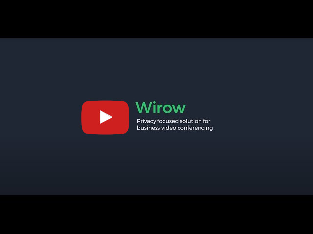
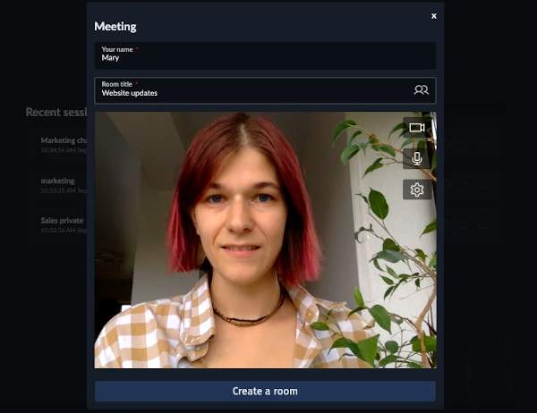

# Wirow video conferencing platform

https://wirow.io

A full featured self-hosted video web-conferencing platform shipped as a single executable.

- Works on any Linux machine.
- Single executable, no setup is required.
- Let's Encrypt integration - instant SSL certs generation for your web-conferencing host.
- Unlimited meeting rooms and webinars.
- Integrated whiteboard.
- Video calls recording.
- Low memory/CPU consumption due to fast core engine written in C.

## Licensing

Wirow platform community edition is distributed under terms of [AGPLv3 license](https://choosealicense.com/licenses/agpl-3.0/)

For a license to use the Wirow software under conditions other than AGPLv3, or for technical support for this software,
please contact us at info@wirow.io

## How to get support

If you have a question, advice or an issue related to your server setup ask for help at [Wirow Discussion Group](https://github.com/wirow-io/wirow-server/discussions).
Please be patient and note what project maintainers have limited time provide a free support on this forum.

Fill an [Issue](https://github.com/wirow-io/wirow-server/issues) If you believe that Wirow has a software bug.

## Intro

[](https://www.youtube.com/watch?v=14-DI3lk_P0)




## Software used by Wirow

- [Mediasoup - C++ WebRTC SFU router](https://github.com/versatica/mediasoup)
- [EJDB2 - Embeddable JSON Database engine](https://github.com/Softmotions/ejdb)
- [IWNET - Asynchronous HTTP Library](https://github.com/Softmotions/iwnet)
- [Excalidraw - A Whiteboard Web UI](https://github.com/excalidraw/excalidraw)
- [FFmpeg](https://ffmpeg.org)
- [Sentry error reporting](https://sentry.io)
- [Svelte Frontend Framework](https://svelte.dev)


## Building Docker Image

[Wirow server Dockerfile](https://github.com/wirow-io/wirow-server/blob/master/docker/Dockerfile)

```sh
cd ./docker
docker build --no-cache --force-rm -t wirow .
```

Please mind about the following volume dirs defined in [Dokerfile](https://github.com/wirow-io/wirow-server/blob/master/docker/Dockerfile):
- `/data` Where wirow database, uploads and room recordings are located.
- `/config/wirow.ini` A server configuration file.

Before starting Wirow docker container
- Read the [Wirow server Administrator's Guide](https://github.com/wirow-io/wirow-server/blob/master/docs/wirow.adoc)
- Review `/config/wirow.ini` ip/network options, ssl certs section (if you don't plan to use Let's Encrypt).

**Basic check of Wirow server availability:**

```sh
docker run --rm wirow -h
```

**Now you have three ways how to run a Wirow server:**
- Wirow server on your domain with Let's Encrypt HTTPS Certificates. (Recommended)
- Wirow server on your host with own HTTPS certificates.
- Wirow server behind HTTP proxy.

### Wirow server on your domain with Let's Encrypt Certificates (Recommended)

Please check what your host is accessible by your domain name and 80/443, 44300-44600 tcp/udp ports are accessible.

Example:

```sh

# Below `start01` is the initial password for `admin` user

docker run --name wirow wirow -n mywirow.example.com -a start01
```
Later you may change your password and manage users by Admin UI.

### Wirow server on your host with own HTTPS certificates

Here is the Example how it could be done:

```sh

WIROWSRC=<path to wirow cloned repo>
WORKDIR=<path to my workdir>

mkdir -p ${WORKDIR}/config
cd ${WORKDIR}/config

openssl req -x509 -nodes -days 3650 -newkey ec:<(openssl ecparam -name prime256v1) \
          -keyout wirow-eckey.pem -out wirow-ecdsacert.pem

cp ${WIROWSRC}/docker/wirow.ini ./wirow.ini

echo -e '\n\n[main]' >> ./wirow.ini
echo 'cert_file = {config_file_dir}/wirow-ecdsacert.pem' >> ./wirow.ini
echo 'cert_key_file = {config_file_dir}/wirow-eckey.pem' >> ./wirow.ini

# Below `start01` is the initial password for admin user

docker run --name wirow -v ${WORKDIR}/config:/config wirow -a start01

23 Apr 17:15:06.543 INFO: main:ip=auto
23 Apr 17:15:06.543 INFO: main:data=/data
23 Apr 17:15:06.543 INFO: rtc:ports=44300..44600
23 Apr 17:15:06.543 INFO: main:cert_file=/config/wirow-ecdsacert.pem
23 Apr 17:15:06.543 INFO: main:cert_key_file=/config/wirow-eckey.pem
23 Apr 17:15:06.543 INFO: Number of workers: 6
23 Apr 17:15:06.544 INFO: Autodetected external IP address for wirow server: 172.17.0.2
23 Apr 17:15:06.544 INFO: Opening /data/wirow.db
23 Apr 17:15:06.791 INFO: Server on: 172.17.0.2:443
23 Apr 17:15:06.791 INFO: HTTP/HTTPS redirect port: 80
```

Now open your browser `https://172.17.0.2` (specific to this example) then enter `admin/start01` credentials at login page.
Later you may change your password and manage users by Admin UI.

### Wirow server behind HTTP proxy

Please refer to [Wirow server Administrator's Guide](https://github.com/wirow-io/wirow-server/blob/master/docs/wirow.adoc)


## Building from sources by hands

### Build Prerequisites

* Linux, macOS or FreeBSD
* Git
* CMake v3.18+
* GNU Make, autoconf, automake, ninja
* Nodejs v14+ and Yarn package manager v1.22+
* Clang C/C++ compiler v10+ or GCC v9+
* yasm assembler (yasm) needed by FFmpeg
* Python 3 pip package manager (python3-pip)

Example of prerequisite software installation on Debian/Ubuntu Linux:

```sh
apt-get install -y apt-utils software-properties-common \
                   apt-transport-https sudo curl wget gpg

wget -O - https://apt.kitware.com/keys/kitware-archive-latest.asc 2>/dev/null \
       | gpg --dearmor -i \
       | tee /etc/apt/trusted.gpg.d/kitware.gpg >/dev/null
wget -qO- https://deb.nodesource.com/setup_lts.x | bash -
wget -qO- https://dl.yarnpkg.com/debian/pubkey.gpg | apt-key add -

apt-add-repository -y 'deb https://apt.kitware.com/ubuntu/ focal main'
echo "deb https://dl.yarnpkg.com/debian/ stable main" | tee /etc/apt/sources.list.d/yarn.list

apt-get update
apt-get install -y autoconf automake pkgconf \
  binutils build-essential ca-certificates cmake \
  g++ gcc git libtool make ninja-build nodejs python-is-python3 yarn \
  yasm python3-pip
```

### Building

```sh
git clone --recurse-submodules https://github.com/wirow-io/wirow-server.git

mkdir -p ./wirow-server/build && cd ./wirow-server/build

cmake ..  -G Ninja \
          -DCMAKE_BUILD_TYPE=RelWithDebInfo \
          -DIW_EXEC=ON
ninja
```

Wirow build artifacts are located here:

```sh
 ./build/src/wirow    # Stripped binary
 ./build/src/wirow_g  # Binary with debug symbols (Not stripped)
```


## Guides

- [Wirow Server Administrator's Guide](https://github.com/wirow-io/wirow-server/blob/master/docs/wirow.adoc) ([pdf](https://github.com/wirow-io/wirow-server/blob/master/docs/wirow.pdf))
- [Wirow Server Configuration Reference](https://github.com/wirow-io/wirow-server/blob/master/docs/wirow-configuration.ini)


# License

```
/*
 * Copyright (C) 2022 Greenrooms, Inc.
 *
 * This program is free software: you can redistribute it and/or modify it under
 * the terms of the GNU Affero General Public License as published by the Free
 * Software Foundation, either version 3 of the License, or (at your option) any
 * later version.
 *
 * This program is distributed in the hope that it will be useful, but WITHOUT
 * ANY WARRANTY; without even the implied warranty of MERCHANTABILITY or FITNESS
 * FOR A PARTICULAR PURPOSE. See the GNU Affero General Public License for more
 * details.
 *
 * You should have received a copy of the GNU Affero General Public License
 * along with this program.  If not, see http://www.gnu.org/licenses/
 */
```
